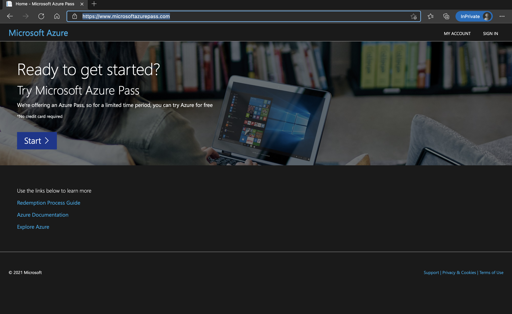
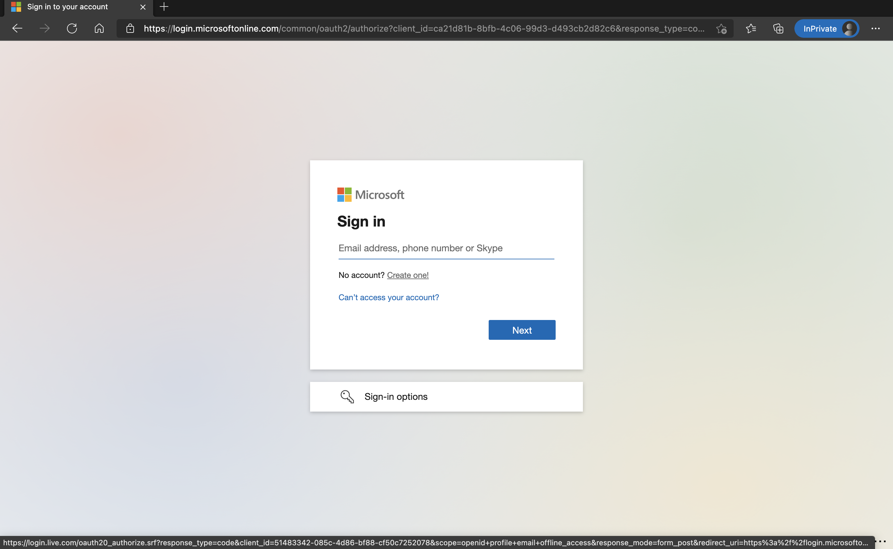
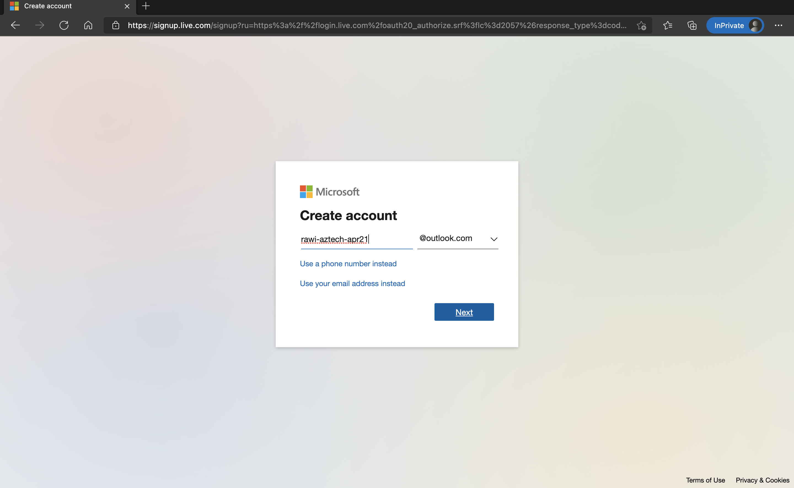
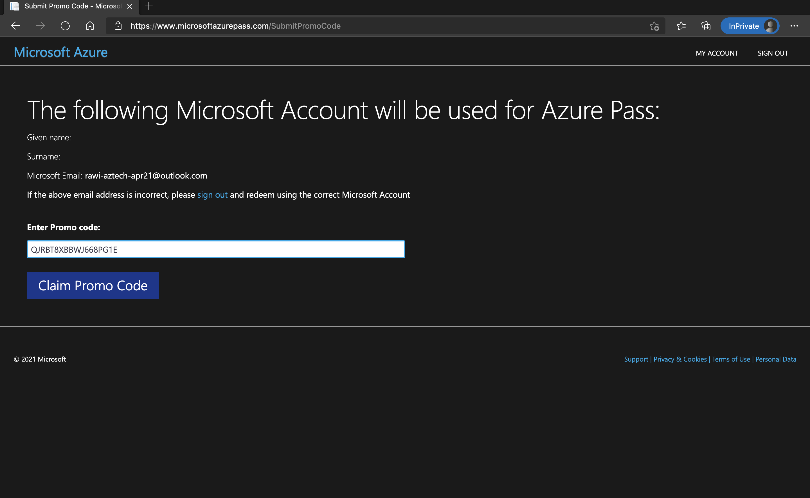
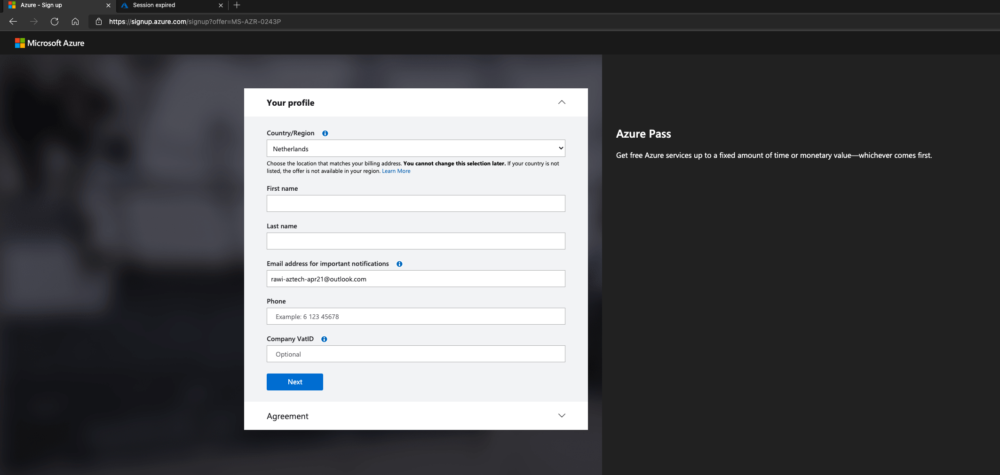
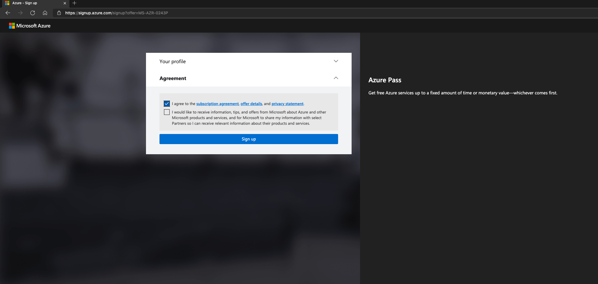
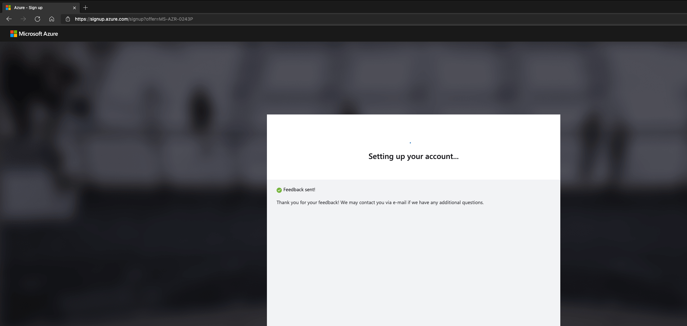
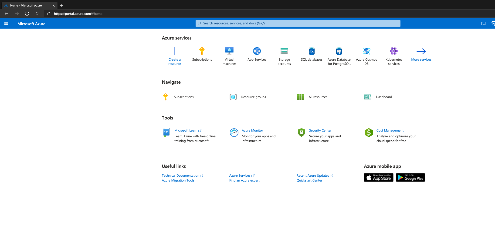
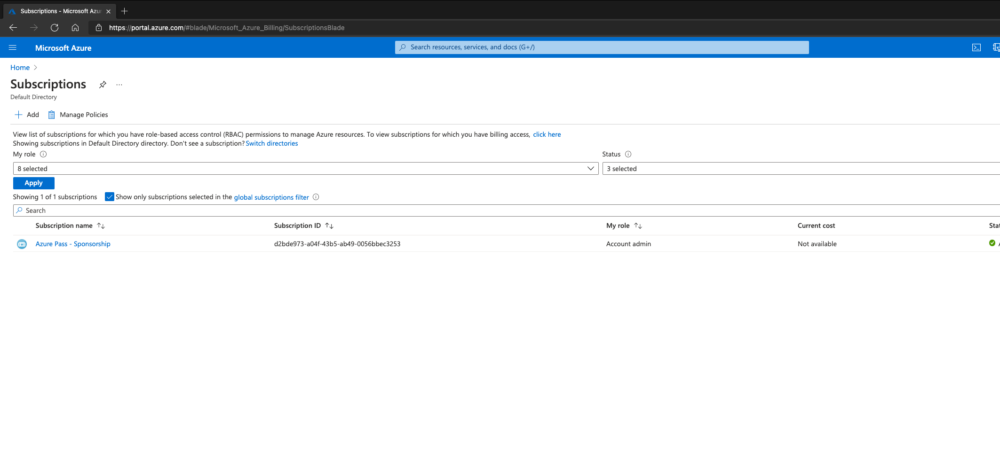

# Configure your Azure Pass

Azure Pass is sponsored offering from Microsoft, which aids learning experiences. It allows us to provide everyone who participates in the training a completely isolated and dedicated environment for their labs.

The offer provides an Azure Subscription with 100USD of credits valid for 30 days from the time of redeeming.

To redeem an Azure Pass, you will need a Microsoft Account. I recommend using a completely new one for for this lab. We will be configuring Azure AD, so a brand new tenant which can be later discarded is the best choice. The following instructions guide you through such a process.

1) Open a private browser window to make sure that you don't accidentally use your existing Microsoft Account or your work account. Go to Home - Microsoft Azure Pass and start the process.

2) When prompted to sign in, choose the option to create a new account and opt-in for a new email address. I recommend using something easily recognizable.

3) Once done, you should be redirected back to the Azure Pass website. Confirm whether you're signed in with the correct account and enter the code which we provided.

4) Fill out your details, read and accept the license agreement, confirm that you're not a robot and wait a while.

5) Once the process completes, you should be redirected to the Azure Portal.

6) Go to Subscriptions to verify whether your Azure Pass was redeemed successfully. If you see a subscription, you're good to start your lab! Have fun!

To start the lab go to [Day Zero AzureAD and Azure setup](dayZero.md)
